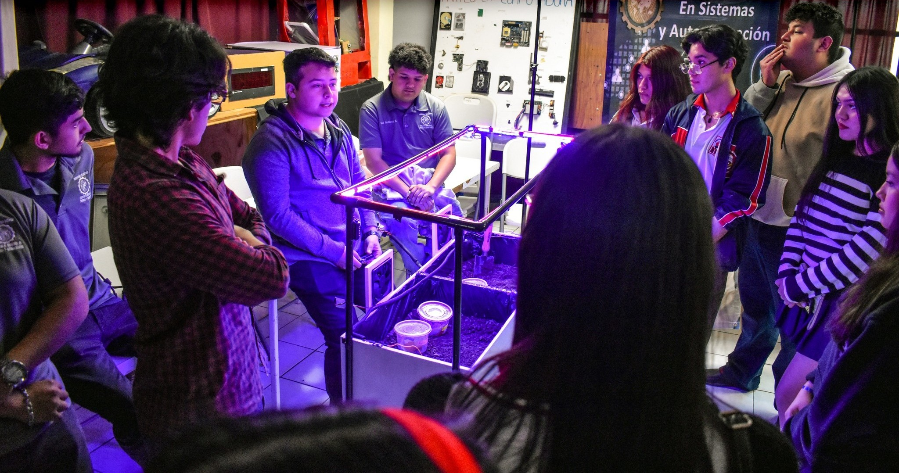
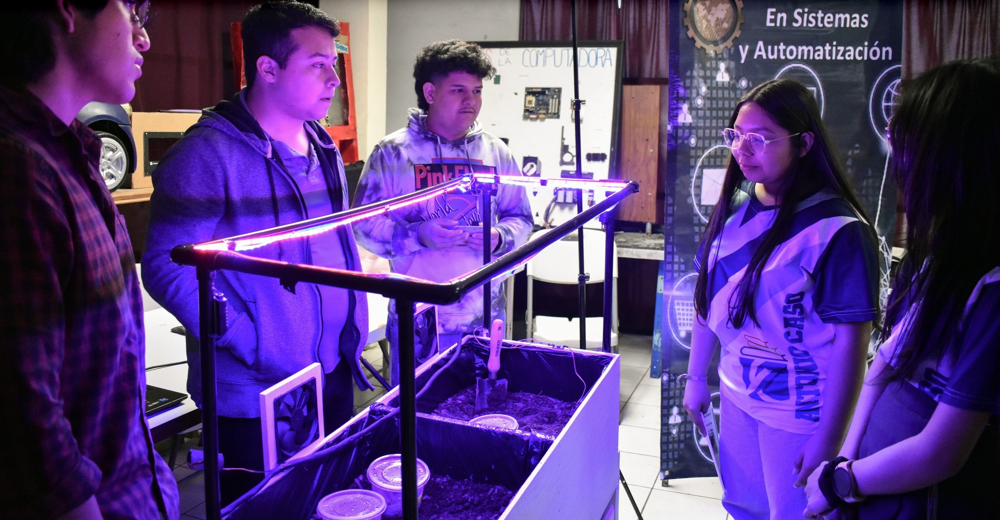

# 🌱 Sistema Automatizado para Invernaderos

Este proyecto presenta un **sistema automatizado para invernaderos**, desarrollado con el objetivo de optimizar el cuidado y crecimiento de las plantas mediante el uso de tecnologías inteligentes.  

## 🚀 Características principales
- **Monitoreo en tiempo real**: Uso de sensores de humedad y temperatura para registrar el estado del ambiente.  
- **Control automático de riego**: Ajuste del riego según las condiciones y necesidades de cada tipo de planta.  
- **Regulación del ambiente interno**: Optimización de los niveles de temperatura y humedad.  
- **Iluminación personalizada**: Las luces se ajustan de manera inteligente para proporcionar el espectro adecuado según las necesidades específicas de cada especie cultivada.  

## ⚠️ Advertencia sobre el hardware
Este sistema está diseñado para funcionar con un **Arduino Mega** debido a la cantidad de pines y recursos necesarios para manejar múltiples sensores y actuadores.  
Si se utiliza otro modelo de Arduino (como el Uno o Nano), es posible que no se cuente con la capacidad suficiente y el sistema no funcione correctamente.  

## 🎯 Objetivo
Garantizar las condiciones óptimas para el crecimiento de diferentes tipos de plantas, reduciendo el esfuerzo manual y aumentando la eficiencia en la producción dentro del invernadero.  

## 🌐 Página web y documentación

Puedes consultar la documentación completa del proyecto, así como más detalles técnicos y avances en el siguiente enlace:

🔗 [Ver documentación en Notion](https://innovative-cave-016.notion.site/Proyecto-Green-Life-60ea8b23e7c040eaa971645b0d738cc6)
